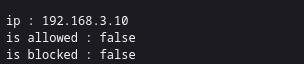

# IPInSubnet - Fast Binary Tree IP Subnet Matching

## Overview
**IPInSubnet** is a Lua library for efficient IPv4 and IPv6 subnet searches using a binary tree. It is designed for scenarios involving a large number of subnets, enabling quick lookups to determine whether an IP address belongs to a specific subnet.


### Features
- Supports both **IPv4** and **IPv6** addresses.
- Efficient binary tree implementation for quick lookups.
- Handles **CIDR notation** for subnet masks.
- Ideal for **firewalls, access control, and Nginx/OpenResty** use cases.

### Requirements
    lua-bitop - for bitwise operations, for Nginx, Openrestry is preinstalled
        apt install lua-bitop

    luaunit - for unit testing
        apt install lua-unit

---
## Usage Example
Below is a complete example in Nginx 

### nginx.conf
```nginx
...
init_by_lua_file "/{YOUR_PATH}/init.lua";
...
server {
    ...
    access_by_lua_file "/{YOUR_PATH}/access.lua";
    ...
}
...
```

### init.lua
```lua
-- Load module dynamically
local info = debug.getinfo(1, "S")  
local path = info.source:sub(2):match("(.*/)")  
package.path = path.."../lib/?.lua;" .. package.path
-- or append to package.path where the lib is saved
-- package.path = package.path .. ";/usr/local/share/lua/IPInSubnet/lib/?.lua"

-- Require the module
IPInSubnet = require("IPInSubnet")

-- Create subnet lists
blockedIPs = IPInSubnet:new()
allowedIPs = IPInSubnet:new()

-- Define allowed and blocked subnets
allowedIPs:addSubnet("192.168.1.0/24")
allowedIPs:addSubnet("192.168.4.0/24")
allowedIPs:addSubnet("192.1.4.0/24")
allowedIPs:addSubnet("192.1.1.0/24")


blockedIPs:addSubnet("192.168.2.0/24")
blockedIPs:addSubnet("11:0db8::/32")
```

### access.lua
```lua
ngx.header.content_type = "text/plain"

ngx.say("IP: ", ngx.var.remote_addr)
ngx.say("Is allowed: ", allowedIPs:isInSubnets(ngx.var.remote_addr))
ngx.say("Is blocked: ", blockedIPs:isInSubnets(ngx.var.remote_addr))
```

### response


#### Show IPv4 tree for allowedIP
```lua
--if you add the subnets
allowedIPs:addSubnet("192.168.1.0/24")
allowedIPs:addSubnet("192.168.4.0/24")
allowedIPs:addSubnet("192.1.4.0/24")
allowedIPs:addSubnet("192.1.1.0/24")

--the tree will have the values from the image. 
-- where *8bits delimiter is a separator for visual efects
ngx.say("Allowed IPs Tree IPv4")
allowedIPs.treeIPv4.printTree(allowedIPs.treeIPv4.root)

```
```
192.168.1.0/24 => 11000000 10101000 00000001 ********
192.168.4.0/24 => 11000000 10101000 00000100 ********
192.1.1.0/24   => 11000000 00000001 00000001 ********
192.1.1.0/24   => 11000000 00000001 00000001 ********

```


